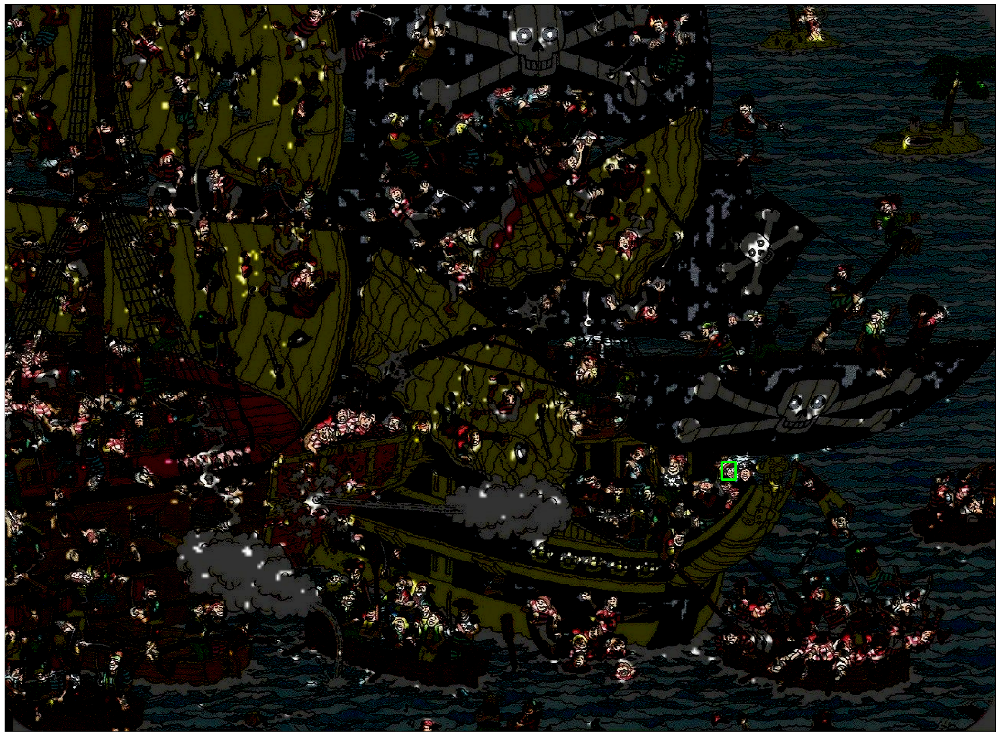

## Where is Waldo? RPN

- This project uses the ideas from the [Faster R-CNN](https://arxiv.org/pdf/1506.01497.pdf) paper and Regional Proposal Networks to find Waldo.
- Transfer learning with VGG16 as a backbone is used.
- Waldo images belong to this [repo](https://github.com/vc1492a/Hey-Waldo/tree/master/original-images).


## How it works

 - Train the RPN on Waldo images to find candidate regions and bounding boxes for Waldo.
 - Implement convolution layers to make prediction and find Waldo among false positive proposals.

## Requirements and Dependencies
```bash
tensorflow==1.11.0
numpy==1.15.4
matplotlib==3.0.2
pandas==0.23.4
Keras==2.2.4
opencv_python==4.2.0.34
```
## Instructions

The main file is `AHF_Waldo.py`. Make sure that it is located in the same folder as the `images`, `annotations`, and the `vgg.h5` model.


### Summary of model
```
_________________________________________________________________
Layer (type)                 Output Shape              Param #   
=================================================================
input_1 (InputLayer)         [(None, None, None, 3)]   0         
_________________________________________________________________
block1_conv1 (Conv2D)        (None, None, None, 64)    1792      
_________________________________________________________________
block1_conv2 (Conv2D)        (None, None, None, 64)    36928     
_________________________________________________________________
block1_pool (MaxPooling2D)   (None, None, None, 64)    0         
_________________________________________________________________
block2_conv1 (Conv2D)        (None, None, None, 128)   73856     
_________________________________________________________________
block2_conv2 (Conv2D)        (None, None, None, 128)   147584    
_________________________________________________________________
block2_pool (MaxPooling2D)   (None, None, None, 128)   0         
_________________________________________________________________
block3_conv1 (Conv2D)        (None, None, None, 256)   295168    
_________________________________________________________________
block3_conv2 (Conv2D)        (None, None, None, 256)   590080    
_________________________________________________________________
block3_conv3 (Conv2D)        (None, None, None, 256)   590080    
_________________________________________________________________
conv2d (Conv2D)              (None, None, None, 512)   1180160   
_________________________________________________________________
conv2d_1 (Conv2D)            (None, None, None, 5)     2565      
=================================================================
Total params: 2,918,213
Trainable params: 1,182,725
Non-trainable params: 1,735,488
_________________________________________________________________
```


## Results
In the following image you can see the proposed regions highlighted. Obviously, there are too many false proposed regions (as we want to!). Waldo is shown in a green box!




